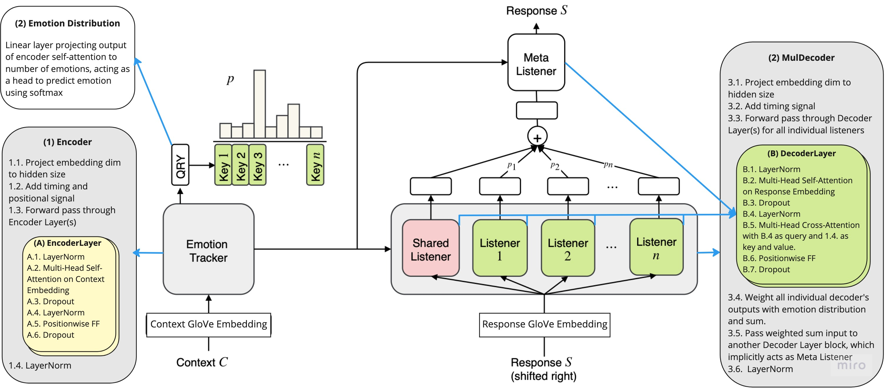
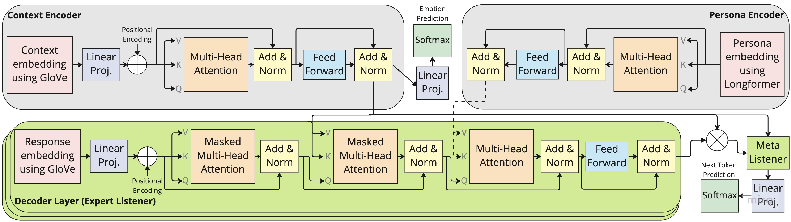

# Improving Empathetic NLG

This work has been done as part of a project for the COMS 6998: Conversational AI course by Prof. Zhou Yu at Columbia University in Fall 2022 semester.

# Abstract

Empathetic response generation is a crucial aspect of many chatbot conversations and tasks. Previous research has shown promising results in this area by leveraging various annotated datasets and approaches, leading to a wide range of literature and tools that work towards building empathetic conversational agents. We propose a modified version of the [MoEL model](https://github.com/HLTCHKUST/MoEL) ([Lin et al., 2019](https://arxiv.org/pdf/1908.07687.pdf)) that takes into account not only emotion but also the speaker’s persona in order to capture the nuances of how different personalities express empathy. We attempt to incorporate methods from different empathetic dialogue paradigms into one model and aim to achieve richer results. Specifically, we adapt our model to work with the [PEC dataset](https://github.com/zhongpeixiang/PEC) ([Zhong et al., 2020](https://arxiv.org/abs/2004.12316)) while leveraging rich persona information about speakers. We also explore the potential of adding additional auxiliary signals to improve empathetic natural language generation through experimentation with meaningful variations of MoEL. Read further [here](Conversational_AI_Final_Report.pdf).

# Explanation of MoEL's Architecture

# Our Methodology

This project consists of four major components:
1. Processing the PEC dataset to create embeddings from persona sentences. In order to capture entire persona, [Longformer](https://arxiv.org/abs/2004.05150) was used to create 3,072-dimensional **persona embeddings**.
1. Training of a BERT-based **emotion classifier** on the Empathetic Dialogue dataset ([Rashkin et al., 2018](https://arxiv.org/abs/1811.00207)), and using it to annotate the context utterances in PEC with emotion labels required for MoEL.
1. **Understanding MoEL**. MoEL is trained on Empathetic Dialogue dataset which consists of 32 distinct emotions, we decided to group similar emotions together in order to simplify the complexity of the task, and work with 16 emotion-groups instead.
1. Modifying MoEL's architecture to condition the emotional response generation on persona. This was done by extending the transformer architecture in MoEL to have a layer of **cross-attention between emotional NLG text and persona-embedding**. Specifically, an additional decoder block was added on top of each of MoEL's individual decoders. The new decoder block queried existing decoder's generated text using a self-attentive persona encoder block's output as key and value. The same has been illustrated in the image below:

While this work requires extensive human evaluations to make strong claims, initial indicators suggest that this method increases the expression of sentiment in MoEL's generated text.

## Command to launch MoEL training:

`python3 main.py --model experts  --label_smoothing --noam --emb_dim 300 --hidden_dim 300 --hop 1 --heads 2 --topk 5 --cuda --pretrain_emb --softmax --basic_learner --schedule 10000`

Optional arguments:
1. `--wandb_project moel` : To log the training run's parameters on wandb.
1. `--ed_16` : To train MoEL on the empathetic-dialogue dataset with 16 emotions. This needs the numpy arrays required by MoEL to be present in ed_16 folder.
1. `--pec_2` : To train MoEL on pec dataset with 2 emotions. This needs the numpy arrays required by MoEL to be present in pec_2 folder.
1. `--pec_32` : To train MoEL on pec dataset with 32 emotions. This needs the numpy arrays required by MoEL to be present in pec_32 folder.
1. `--use_persona` : To train MoEL with persona embeddings pec dataset with 32 emotions. This needs the corresponding numpy arrays to be present.
